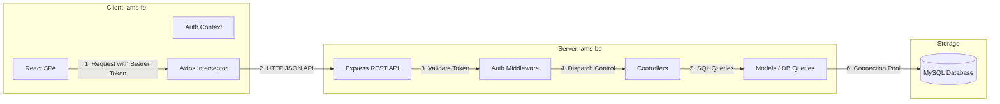

# System Architecture Document

This document outlines the software architecture, folder organization, request lifecycles, and security integrations of the Asset Management System (AMS).

---

## 1. High-Level Architecture

The AMS follows a traditional **Client-Server Architecture** operating as a monorepo with separated backend and frontend codebases:



- **Frontend**: A React Single Page Application (SPA) compiled with Vite. It interacts with the backend strictly through HTTP requests using Axios.
- **Backend**: An Express REST API running on Node.js. It manages system routing, access controls, business rules, and communicates with the database.
- **Database**: A relational MySQL database storing tables (`users`, `assets`, `asset_assignments`, etc.).


---

## 2. Directory & Component Layout

### 2.1 Backend Architecture (`ams-be`)
The backend is organized into functional layers:
- **`server.js`**: Application entry point, starts the HTTP listener on `PORT`.
- **`app.js`**: Scaffolds the Express application, configures CORS, parses JSON bodies, and registers API routers.
- **`config/`**: Connection parameters (MySQL database pool setup).
- **`routes/`**: Grouped API routes (e.g. `authRoutes.js`, `assetRoutes.js`) mapping HTTP methods/URIs to controller handlers.
- **`middleware/`**: Middlewares executing pre-controller routines (JWT token parsing `authMiddleware.js`, role check curriers `roleMiddleware.js`, logging interceptors).
- **`controllers/`**: Core request coordinators. They unpack request data, query database models, structure JSON responses, and catch errors.
- **`models/`**: Object representations mapping database rows to JavaScript methods. They hold raw MySQL prepared statement queries.
- **`services/`**: Supporting services (currently placeholders for future extensions).
- **`utils/`**: Helper files (UUID string generators, constants).

### 2.2 Frontend Architecture (`ams-fe`)
- **`main.jsx` & `App.jsx`**: Bootstraps the React framework, registers context wrappers, and mounts routing targets.
- **`routes/`**: Handles path mappings:
  - `AppRoutes.jsx`: Centralizes page routing.
  - `AdminRoute.jsx`: Router guard redirecting non-admins or unauthenticated sessions back to the Login (`/`) page.
- **`context/`**: Global states:
  - `AuthContext.jsx`: Distributes logged-in user profiles, JWT strings, and login/logout methods.
- **`api/`**: Network abstraction layer (Axios configurations, JWT bearer token interceptors, module-specific API classes).
- **`pages/`**: Primary viewport pages linked to React Router endpoints (Dashboard, Users, Assets, Assignments, Settings).
- **`components/`**: Reusable modular widgets grouped by feature areas (e.g., tables, modal forms, chart graphs).

---

## 3. Data & Request Lifecycle

A standard authenticated request flows through the backend as follows:

```mermaid
sequenceDiagram
    participant User as User Browser
    participant Express as Express App
    participant AuthMW as Auth Middleware
    participant Controller as Controller
    participant Model as DB Model
    participant MySQL as MySQL Database

    User->>Express: GET /api/assets/uuid-123 (Auth Header: Bearer token)
    Express->>AuthMW: Intercept Request
    AuthMW->>AuthMW: Decode & Verify JWT against JWT_SECRET
    alt Token Invalid
        AuthMW-->>User: 401 Unauthorized (JSON response)
    else Token Valid
        AuthMW->>Controller: req.user = payload; next()
        Controller->>Model: Asset.getById(id)
        Model->>MySQL: SELECT * FROM assets WHERE asset_id = ?
        MySQL-->>Model: Return result row
        Model-->>Controller: Return Javascript Object
        Controller-->>User: 200 OK (Asset data JSON payload)
    end
```

---

## 4. Security Framework
1. **Password Safety**: Hashed using `bcryptjs` with 10 salt rounds before being written to the database. Plain text passwords are never stored or logged.
2. **Access Security**: JWTs contain encoded user IDs and roles, signed with a server-side `JWT_SECRET`. Tokens are verified on every protected API call.
3. **Database Security**: All SQL statements use prepared statements (`db.query('SELECT ... WHERE id = ?', [id])`) provided by the `mysql2` driver, preventing SQL Injection attacks.
4. **CORS Configuration**: Restricts access to authorized origins defined in the backend environment variables.
