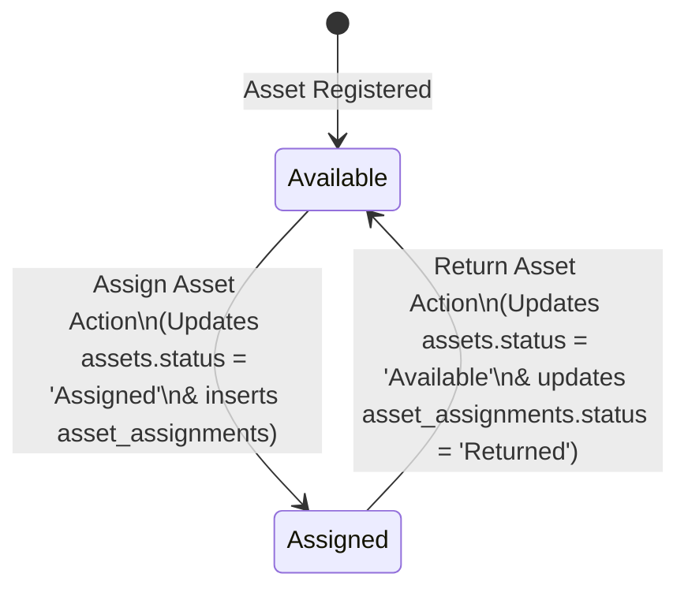

# Phase 4: Asset Assignment

This phase tracks the lifecycle of asset allocations to users, recording assignment history, handling return submissions, and managing automated status transitions.

## 1. Database Schema

The `asset_assignments` table connects assets and users:

```sql
CREATE TABLE asset_assignments (
    assignment_id CHAR(36) PRIMARY KEY,
    asset_id CHAR(36) NOT NULL,
    user_id CHAR(36) NOT NULL,
    assigned_date DATE NOT NULL,
    return_date DATE,
    status ENUM('Assigned','Returned') DEFAULT 'Assigned',
    created_at TIMESTAMP DEFAULT CURRENT_TIMESTAMP,
    FOREIGN KEY (asset_id) REFERENCES assets(asset_id) ON DELETE CASCADE,
    FOREIGN KEY (user_id) REFERENCES users(user_id) ON DELETE CASCADE
);
```

- **`assignment_id`**: Generated as a UUID (v4) using the backend `generateId.js` utility.
- **`status`**: Tracked as `Assigned` (active allocation) or `Returned` (returned to pool).
- **`return_date`**: Records when the item was returned.

---

## 2. Status Transitions

Assignment actions trigger database transactional updates on both tables:



- **Assigning an Asset**: Transitions the asset's `status` column to `'Assigned'`.
- **Returning an Asset**: Transitions the asset's `status` column back to `'Available'`.

---

## 3. Backend API Endpoints

All routes are mapped under `assignmentRoutes.js` and managed via `assignmentController.js`.

### API Routes
- **`GET /api/assignments`**: Returns all asset assignment entries, detailing the asset and user names.
  - **SQL Query**:
    ```sql
    SELECT
      aa.*,
      a.asset_name,
      a.asset_code,
      u.name AS user_name
    FROM asset_assignments aa
    JOIN assets a ON aa.asset_id = a.asset_id
    JOIN users u ON aa.user_id = u.user_id
    ORDER BY aa.created_at DESC
    ```
  - **Response (200 OK)**:
    ```json
    {
      "success": true,
      "assignments": [
        {
          "assignment_id": "uuid-987",
          "asset_id": "uuid-123",
          "user_id": "uuid-456",
          "assigned_date": "2026-06-14",
          "return_date": null,
          "status": "Assigned",
          "asset_name": "MacBook Pro",
          "asset_code": "AST-001",
          "user_name": "John Doe"
        }
      ]
    }
    ```
- **`POST /api/assignments`**: Allocates an asset to a user.
  - **Request Body**:
    ```json
    {
      "asset_id": "uuid-123",
      "user_id": "uuid-456",
      "assigned_date": "2026-06-14"
    }
    ```
  - **Processing**:
    1. Generates UUID for `assignment_id`.
    2. Inserts a row into `asset_assignments`.
    3. Executes `UPDATE assets SET status='Assigned' WHERE asset_id=?`.
  - **Response (201 Created)**:
    ```json
    {
      "success": true,
      "message": "Asset assigned"
    }
    ```
- **`PUT /api/assignments/:id/return`**: Handles returns of assets.
  - **Processing**:
    1. Queries the target assignment to locate the corresponding `asset_id`.
    2. Updates `asset_assignments` (sets `status='Returned'`, `return_date=CURDATE()`).
    3. Updates the target asset (sets `status='Available'`).
  - **Response (200 OK)**:
    ```json
    {
      "success": true,
      "message": "Asset returned"
    }
    ```

---

## 4. Frontend Integration

Exposed under `/assignments` in the browser application.

### API Wrappers (`assignmentApi.js`)
Axios endpoints:
- `getAssignments()`
- `assignAsset(data)`
- `returnAsset(id)`

### Page Component (`Assignments.jsx`)
Coordinates lists of assignments, user profiles (retrieved via `getUsers`), and assets filtered down to those with `'Available'` status.
- `fetchData`: Orchestrates sequential API requests to refresh the state of dropdown options and tables.
- `handleAssign`: Dispatches values to `assignAsset` and calls `fetchData` to refresh status.
- `handleReturn`: Dispatches request to `returnAsset(id)` and calls `fetchData`.

### Sub-Components
- **`AssignmentForm.jsx`**: Select input form that lists available assets and active users. Pre-populates the assignment date input with the current ISO date.
- **`AssignmentTable.jsx`**: Displays list of active/inactive allocations. If status is `Assigned`, a green "Return" button is rendered, executing the return API request on click.
